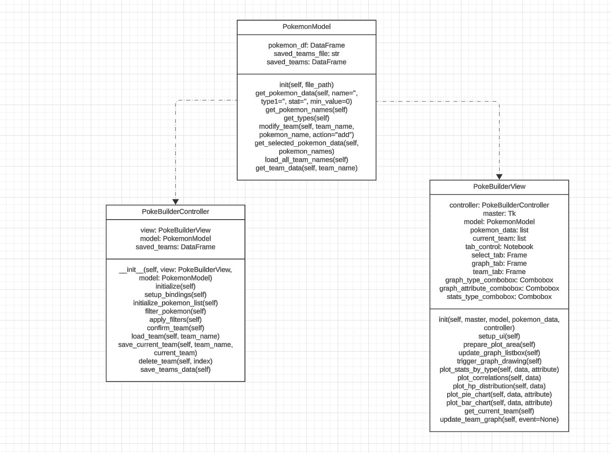

# Pokebuild
### The Pokemon Team Builder app helps users create strong and strategic teams for figthing in Pokemon game

## Data Sources

The dataset for this project is from [Kaggle](https://www.kaggle.com/datasets/arnavvvvv/pokemon-pokedex/data
).

## Running the Application

### Requirements

To run the application, ensure you have the following dependencies installed:

pandas>=2.2.2
seaborn>=0.13.2
matplotlib>=3.8.4
numpy >=1.26.4

## Instructions

### Clone the repository:

```
git clone https://github.com/wannaeattaco/Pokebuilder.git
```

### Create a virtual environment and install dependencies

1. Change your directory to Pokebuilder
```
cd Pokebuilder
```
2. Change your directory to code
```
cd code
```
3. Create virtual environment using this command.
```
python -m venv env
```

4. Activate the virtual environment
```
# On Linux or MacOS
source env/bin/activate

# On MS Windows
env\Scripts\activate
```

5. Installing Dependencies
```
pip install -r requirements.txt
```

6. Run the application:

```
python main.py
```

(For macOS users, use `python3 main.py` instead of `python main.py`)

## UML Diagram


## Sequence Diagram
